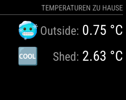

# MMM-Temp2IOT

**MMM-Temp2IOT** is a MagicMirror module designed to display temperature readings from **[Temp2IOT](https://github.com/100prznt/Temp2IoT)** sensors. The module fetches data from a the API and dynamically adjusts the displayed icons based on the current temperature. Perfect for monitoring indoor or outdoor temperatures with a touch of personalization.

## Features

- Displays temperature.
- Dynamic icons that change based on temperature ranges (fully customizable).
- Supports user-defined sensor names.
- Configurable update interval for API requests.
- easily customizable via CSS.
- Integrates seamlessly into your MagicMirror setup.

## Example Screenshot



## Requirements
A [Temp2IOT](https://github.com/100prznt/Temp2IoT) device with two sensors connected.

## Installation

1. Clone the repository into your `modules` folder:
   ```bash
   cd ~/MagicMirror/modules
   git clone https://github.com/ChrisF1976/MMM-Temp2IOT.git
   cd MMM-Temp2IOT
   npm install
   ```

2. Add the module to your MagicMirror config.js file:
```bash
{
    module: "MMM-Temp2IOT",
    position: "top_right",
    header: "Home Temperature",
    config: {
        apiUrl: "http://192.168.178.140/api", // Replace with your API URL
        updateInterval: 60 * 1000, // Update every 60 seconds
        replaceNames: ["Outside", "Shed"], // Custom names for sensors
        icons1: [
            { condition: "<0", icon: "twemoji:cold-face" },
            { condition: "<5", icon: "noto:cold-face" },
            { condition: "<15", icon: "fluent-emoji:cold-face" },
            { condition: "<20", icon: "noto:smiling-face-with-sunglasses" },
            { condition: "<25", icon: "noto:grinning-face-with-sweat" },
            { condition: "<30", icon: "noto:hot-face" },
            { condition: "<40", icon: "noto:hot-springs" },
            { condition: "<100", icon: "noto:exploding-head" },
        ],
        icons2: [
            { condition: "<0", icon: "noto:snowflake" },
            { condition: "<10", icon: "noto:cool-button" },
            { condition: "<20", icon: "noto:check-mark-button" },
            { condition: "<30", icon: "noto:fast-up-button" },
            { condition: "<40", icon: "noto:sos-button" },
            { condition: "<100", icon: "noto:exploding-head" },
        ],
    },
},
 ```
  
3. Restart MagicMirror
 
 ## Configuration Options

| Option           | Description                                                                | Default                    |
|------------------|----------------------------------------------------------------------------|----------------------------|
| `apiUrl`         | The API endpoint to fetch temperature data.                                | `http://localhost/api`     |
| `updateInterval` | Time in milliseconds between API updates.                                  | `60000` (1 minute)         |
| `replaceNames`   | Array of custom names for the sensors, in order of the API response.       | `["Outside", "Shed"]`      |
| `icons1`         | Array of icon rules for the first sensor (temperature-based).              | See example config         |
| `icons2`         | Array of icon rules for the second sensor (temperature-based).             | See example config         |

---
 
 ## Credits
 Many thanks to [Elias Rümmler](http://www.100prznt.de) ([@rmmlr](https://github.com/rmmlr)) for sharing this [Temp2IOT Project](https://github.com/100prznt/Temp2IoT).
 
 ## License
This project is licensed under the MIT License. See the [LICENSE](LICENSE) file.

---
